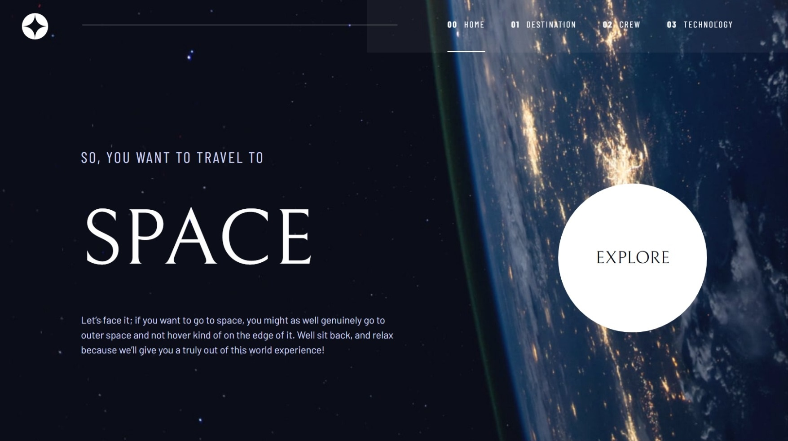
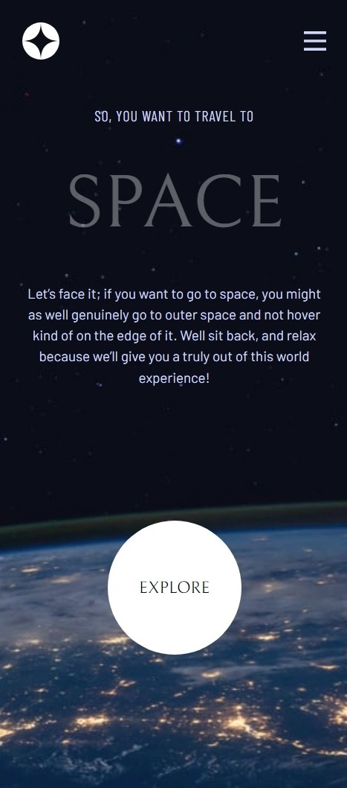
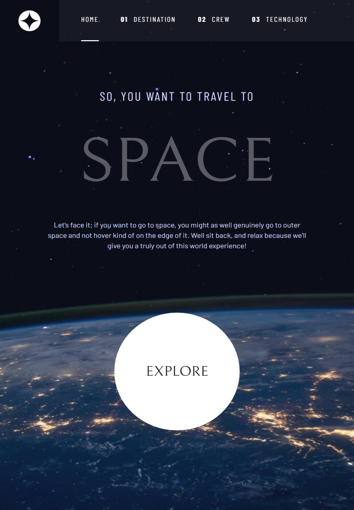

## Table of contents

- [Overview](#overview)
  - [The challenge](#the-challenge)
  - [Screenshot](#screenshot)
  - [Links](#links)
- [My process](#my-process)

  - [Built with](#built-with)
  - [What I learned](#what-i-learned)
  - [Continued development](#continued-development)

- [Author](#author)

## Overview

### The challenge

Users should be able to:

- View the optimal layout for the component depending on their device's screen size
- See the different data when switch planet option
- See the animation when enter each page

### Screenshot

-layout

-website tour

### Links

- Solution URL: [https://github.com/Benson0721/Space-Website]
- Live Site URL: [https://benson0721.github.io/Space-Website/]

## My process

### Built with

- Semantic HTML5 markup
- CSS custom properties
- Flexbox
- React
- Scss
- TailwindCss
- Mobile-first workflow
- Three.js

### What I learned

This project give me more confident to try something that I want to fulfill but it still new to me.
To figure out how to use them and make them really show up in website is feel satisfied.
Complate this project is meanful to me. It time for create thing that is REALLY belong to me.

### Continued development

I want to create project that using RESTful api and more focus on functionality.

## Author

- Github - [Mpass](https://github.com/Benson0721)
- Frontend Mentor - [@Mpass](https://www.frontendmentor.io/profile/Benson0721)
